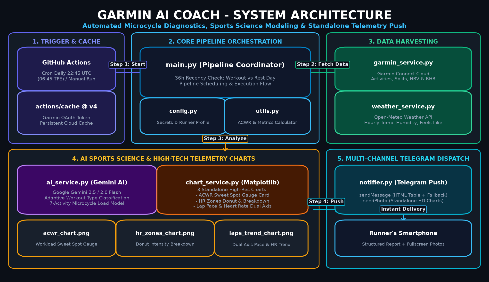
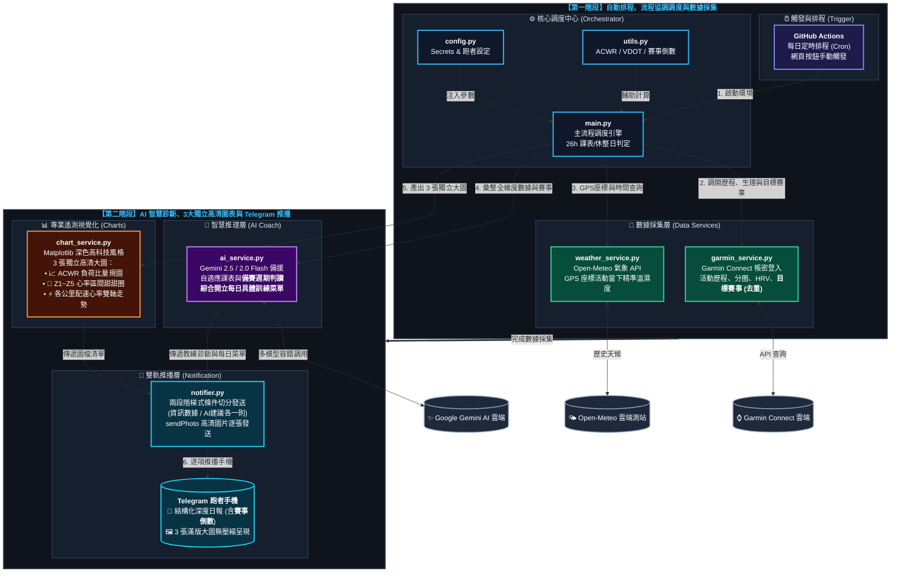

# 🏃 AI Coach - 個人化智慧馬拉松 AI 教練

[](https://www.python.org/)
[](https://github.com/features/actions)
[](https://connect.garmin.com/)
[](https://ai.google.dev/)
[](https://telegram.org/)
[](https://flin1009.github.io/AI_Coach/)

> 🌐 **專案官方形象與互動介紹網站**：[https://flin1009.github.io/AI_Coach/](https://flin1009.github.io/AI_Coach/)（支援手機實機報表預覽、VDOT 跑力與有氧解耦率即時線上試算）

**AI Coach** 是一個專為耐力跑者打造的「全自動化智慧訓練診斷系統」。系統每日透過 **GitHub Actions** 定時排程自動執行，主動調閱 **Garmin Connect** 最新跑步與交叉訓練數據、**三個月內目標賽事倒數**，整合 **Open-Meteo** 活動當下之精準歷史溫濕度氣象，並透過 **Google Gemini AI**（具備多模型自動降級備援技術）進行「7 筆微週期訓練負荷評估」、「目標賽事備賽週期分析」與「最新課表全維度深層解剖」，綜合開立包含精確配速與距離的「每日具體訓練菜單」，最終將結構化的診斷報告與個人化訓練建議直接推播至跑者的 **Telegram**。

---

## 📐 系統架構圖 (System Architecture)

<div align="center">
  
</div>

<br/>

<details open>
<summary><b>📊 點擊切換 / 展開 互動式向量流程圖 (Mermaid High-Contrast Diagram)</b></summary>


</details>

---

## 🌟 核心功能亮點

### 1. ⌚ 全維度 Garmin 數據深度解剖
* **基礎運動表現**：移動與總耗時對比、距離、卡路里、平均/最佳配速、平均/最高心率。
* **高階跑步動態 (Running Dynamics)**：全面解析 **跑步功率 (W)**、**步頻 (spm)**、**步幅 (m)**、**垂直振幅 (cm)**、**步幅比 (%)** 與 **觸地時間 (ms)**，診斷跑姿經濟性與著地負擔。
* **心率區間分佈 (Z1~Z5)**：自動換算各區間累計時間與佔比，檢視能量系統刺激比例。
* **生理負荷評估**：有氧/無氧訓練效果 (Training Effect, TE)、活動訓練負荷值 (Activity Training Load) 與 VO2 Max。
* **詳細分圈明細**：逐公里記錄配速、心率、步頻、爬升高度。

### 2. 🌤️ 歷史氣候精準還原 (Open-Meteo)
* 系統根據活動的 **起始經緯度座標** 與 **起跑時間**，動態查詢 Open-Meteo 每小時歷史氣象數據。
* 即時帶出當時氣溫、相對濕度、體感溫度與天氣概況，幫助 AI 評估熱壓力、補水效率與心率漂移（Cardiac Drift）。
* 若為室內跑步（無 GPS 軌跡），系統自動切換至預設測站座標查詢室外天候。

### 3. 🤖 自適應課表判讀與 Gemini 503 備援機制
* **自適應課表類型辨識**：不拘泥於單一 Zone 2 判斷，AI 自動依心率、配速、功率與各區間佔比，精準識別：
  * 🟢 輕鬆恢復跑 (Recovery Run)
  * 🔵 有氧基礎耐力跑 (Zone 2 Endurance)
  * 🟡 馬拉松配速跑 (Marathon Pace, MP)
  * 🟠 乳酸閾值 / 節奏跑 (Tempo Run)
  * 🔴 高強度間歇 / 衝刺 (Interval)
* **7 筆微週期疲勞監控**：前 6 筆活動提供一週累積總跑量、交叉訓練（自行車、重訓、游泳等）脈絡，診斷急性疲勞指數（Acute Training Load），給予次日最科學的訓練/休整處方。
* **動態多模型降級 (Fallback Mechanism)**：啟動時自動掃描 Google 最新版 Flash 模型清單並由新至舊排序。遭遇 Google 伺服器尖峰 503 UNAVAILABLE 錯誤時，自動無縫切換備援模型重試。

### 4. 📈 ACWR 負荷比與體能監測 (Acute:Chronic Workload Ratio)
* 自動回溯近 28 天訓練大數據，精準計算急劇負荷（近 7 天）與慢性體能（近 28 天週均）之比值。
* 科學標記體能增長區間與預防受傷風險：
  * 🟢 **最佳適應甜點區 (Sweet Spot, 0.8 ~ 1.3)**：安全增長有氧體能，受傷風險最低。
  * 🟡 **疲勞警戒期 (Caution, 1.3 ~ 1.5)**：急劇疲勞快速累積，提醒跑者密切監控肌肉狀態。
  * 🔴 **高受傷風險區 (Danger Zone, ≥ 1.5)**：過度訓練預警，AI 教練主動介入要求減量。

### 5. 🎯 丹尼爾博士 VDOT 跑力與五大訓練靶心配速 (Jack Daniels' Formula)
* 系統根據跑者全馬 PB 自動套用 **Daniels & Gilbert (1979) 攝氧量阻力公式**，計算當前精準 **VDOT 跑力值**。
* 自動推算並輸出精確到「分:秒/km」的五大訓練靶心配速指針：
  * 🟢 **E 輕鬆/長距離跑配速 (Easy)**：Zone 2 有氧基礎、主動恢復跑與 LSD 巡航區間。
  * 🔵 **M 馬拉松目標配速 (Marathon)**：比賽巡航節奏與專項配速體感建立。
  * 🟡 **T 乳酸閾值/節奏跑配速 (Threshold)**：提升抗乳酸閾限與速耐力。
  * 🟠 **I 最大攝氧量間歇配速 (Interval)**：刺激心肺極限容量 (VO2Max)。
  * 🔴 **R 重複衝刺配速 (Repetition)**：神經肌肉速度協調與跑姿經濟性強化。
* **AI 教練精準開立課表**：次日課表建議不再僅是籠統的文字描述，而是直接指定「*建議進行 6~8km E 配速跑 (5:45~6:15/km)*」，訓練目標極為具體。

### 6. 💓 前後半程有氧解耦率 (Aerobic Decoupling / Decoupling %)
* 引入運動生理學權威 Joe Friel 之 **效率因子 EF (Efficiency Factor = 功率或速度 / 心率)** 模型。
* 將長跑活動切分為前半程（前 50% 距離）與後半程（後 50% 距離），精準計算心率漂移率：

$$
\text{Decoupling (\\%)} = \frac{\text{EF}_1 - \text{EF}_2}{\text{EF}_1} \times 100\\%
$$

* **參數定義**：
  * $\text{EF}_1$：前半程效率因子（有功率時為 `功率 (W) / 心率 (bpm)`，無功率時為 `速度 (m/min) / 心率 (bpm)`）
  * $\text{EF}_2$：後半程效率因子（計算方式同前半程）

* **四大科學耐力等級判定**：
  * 🟢 **< 3.0% (極度穩定 Elite Aerobic Base)**：有氧底層堅固，幾乎無心率漂移。
  * 🔵 **3.0% ~ 5.0% (最佳適應 Well-Trained)**：心率與配速平衡良好，具備優秀馬拉松耐力。
  * 🟡 **5.1% ~ 8.0% (輕度漂移 Moderate Drift)**：後半程出現散熱或肌耐力衰退，提醒加強電解質與水分補充。
  * 🔴 **> 8.0% (顯著解耦 High Drift)**：體能超載、配速過快或外部熱壓力過大，AI 教練主動提出預警。
* **走勢圖視覺化**：於各公里配速心率雙軸走勢圖自動標繪半程分割線 (Halfway Split) 與解耦漂移數據徽章。

### 7. 🏆 未來三個月目標賽事倒數與 AI 每日訓練菜單 (Race Target & Daily Workout Menu)
* **Garmin 訓練行事曆目標賽事自動擷取**：系統自動檢索 Garmin Connect 日曆中未來三個月（90 天內）已報名之目標賽事（包含全馬、半馬或自訂路跑賽事）。
* **跨月日曆網格智慧去重**：針對 Garmin Connect 月曆 API 前後週重疊問題，採用 `item.id` 唯一性集合進行去重，並嚴格依時間窗口過濾過期與超期賽事，絕不重複列出。
* **倒數週數與里程卡片**：於 Telegram 日報以清楚卡片呈現 `🚩 2026-10-25 (倒數 32 天 (約 4 週)) 2026 長榮航空城市觀光半程馬拉松 | 21.1km`（無賽事時自動優雅隱藏，不佔版面）。
* **備賽週期判讀與每日具體菜單**：Gemini AI 自動根據賽事倒數天數/週數，識別跑者當前處於何種備賽階段（基礎耐力期、專項速度期、高峰期、賽前減量期 Taper），結合近期的 ACWR 急性與慢性負荷比、今日生理恢復狀況與丹尼爾 VDOT 靶心配速，為跑者量身開立「**每日具體訓練菜單**」（指定訓練目的 E/M/T/I/R、預計公里數、精確靶心配速範圍與暖身收操指引）。系統更**智慧識別平日與週末**：平日開立基準核心課表並同時提供「晨跑族（動態熱身/空腹燃脂）vs. 夜跑族（能量儲備/壓力調控）」二擇一指南；週末則動態附上「下午起跑（首選）、晨間起跑（賽事模擬）、晚間起跑（短平快）」之 3 大起跑時段微調指南！

### 8. 🩺 智慧生理指標優雅降級 (Graceful Degradation)
* 自動安全讀取夜間 **HRV 心率變異度**（前夜平均、7日基準線、平衡狀態）、**靜止心率 (RHR)** 與 **身體電量**。
* **零干擾防護**：若手錶未同步或未配戴入睡，系統自動無縫略過該區塊，絕不拋錯中斷；有數據時無縫融入 AI 提示詞評估中樞神經系統修復度。

### 9. 📊 專業遙測圖表與 Telegram 智慧推播
* **雙軌訊息邏輯切分 (Smart Message Splitting)**：整份長報表依邏輯自動切分為兩則獨立推播，大幅提升閱讀體驗：
  * **第一則（跑者資訊與活動數據）**：跑者背景、VDOT 靶心配速、三個月目標賽事倒數、生理恢復 (HRV/RHR)、ACWR 急慢性負荷、近期歷程與今日分圈細節。
  * **第二則（Gemini AI 建議）**：由 `🤖 【Gemini AI 教練建議】` 開頭，專門呈現深度診斷、賽事週期洞見與每日具體訓練菜單。
  * **字數安全切分**：每則訊息若超過 4000 字元上限，系統依然會自動再行分段，絕不因字數超限而遺失任何文字。
* **獨立高清晰度圖表 (Standalone Telemetry Charts)**：告別多圖擠在一起排版擁擠的困擾，系統將各項核心指標獨立繪製為大尺寸圖表（包含 **ACWR 急性與慢性負荷指標圖**、**Z1~Z5 心率區間環圈甜甜圈圖**、**各公里配速心率雙軸走勢圖**），透過 Telegram 逐張推播，手機端滿版呈現、字體大且數據清晰易讀。
* **純文字清晰分圈明細**：逐公里配速、心率、海拔上升、步頻與總時間以條理分明之格式排版，保證在所有裝置上完美相容。
* **LaTeX 符號淨化**：自動過濾 AI 產生的 `$\rightarrow$` 數學符號為標準箭頭 `→`。

---

## 📂 專案檔案結構 (File Structure)

```text
AI_Coach/
├── .github/
│   └── workflows/
│       ├── daily_task.yml       # GitHub Actions 每日排程與自動化環境
│       ├── test_calendar.yml    # 目標賽事與行事曆手動一鍵驗證工作流
│       └── cleanup_runs.yml     # 一鍵清空所有 Actions 歷史執行紀錄工作流
├── docs/                        # GitHub Pages 官方形象與互動介紹網站
│   ├── assets/                  # 網站專用高解析度架構圖與遙測圖表
│   └── index.html               # 專案官網 (Tailwind CSS + VDOT/解耦率線上試算)
├── config.py                    # 集中管理 Secrets 環境變數與跑者個人化參數
├── utils.py                     # VDOT 跑力、有氧解耦率、目標賽事倒數、ACWR 與生理恢復運算工具
├── weather_service.py           # Open-Meteo 氣象 API 連線與歷史小時氣候模組
├── chart_service.py             # 專業運動遙測儀表板圖表繪製模組 (Matplotlib 深色高科技風格)
├── notifier.py                  # Telegram 機器人訊息分段推播 (條件切分+字數防護) 與高清圖檔發送
├── garmin_service.py            # Garmin Connect 登入、活動歷程、分圈、每日生理與目標賽事調閱
├── ai_service.py                # Gemini AI 模型動態掃描、備賽週期判讀與每日具體訓練菜單開立
├── main.py                      # 系統主協調調度核心引擎（GitHub Actions 執行入口點）
├── test_garmin_calendar.py      # 本機/雲端行事曆與目標賽事診斷測試腳本
├── .gitignore                   # Git 排除清單（忽略敏感檔案、快取、虛擬環境與本機記錄）
└── README.md                    # 專案詳細介紹與架構文檔
```

---

## 🔑 依賴 API 清單與申請教學 (APIs & Prerequisites)

本專案運作需串接以下 4 項服務，各服務的申請需求與教學如下：

| 服務名稱 | 角色與用途 | 是否需申請 | 費用 | 取得方式 / 參考教學 |
| :--- | :--- | :---: | :---: | :--- |
| **Google Gemini API** | 智慧教練數據分析、課表判讀與疲勞建議 | **需申請** | 免費額度足夠日常使用 | [Google AI Studio](https://aistudio.google.com/) 申請 API Key |
| **Telegram Bot API** | 每日分析報表推播至手機 Telegram | **需申請** | 完全免費 | 透過 Telegram [@BotFather](https://t.me/botfather) 建立機器人 |
| **Garmin Connect** | 取得手錶同步之活動、分圈與高階動態數據 | **無需特別申請** | 免費 | 使用個人 Garmin Connect 帳號密碼 |
| **Open-Meteo API** | 依活動 GPS 與時間查詢歷史氣溫與濕度 | **免申請 / 免 Key** | 開源免費 (非商業每日萬次) | 免註冊直接調用 [Open-Meteo Docs](https://open-meteo.com/) |

---

### 1. 🤖 Google Gemini API Key 申請教學
Gemini API 提供頂尖的生成式 AI 推理能力，用於深度解析跑者的各維度數據。

1. **前往申請網站**：瀏覽 [Google AI Studio (https://aistudio.google.com/)](https://aistudio.google.com/)。
2. **登入帳號**：使用您的個人 Google 帳號登入。
3. **建立 API Key**：
   - 點選左上角選單的 **「Get API key」** 按鈕。
   - 點擊 **「Create API key」**。
   - 選擇既有的 Google Cloud 專案，或直接選擇「Create API key in new project」自動建立新專案。
4. **複製保存**：系統將產生一串以 `AIzaSy...` 開頭的金鑰字串，複製並妥善保管，此即為 `GEMINI_API_KEY`。
5. **官方參考教學**：
   - [Gemini API 快速入門指南 (官方繁中)](https://ai.google.dev/gemini-api/docs/quickstart?lang=python)
   - [Google AI Studio 說明文件](https://ai.google.dev/aistudio)

---

### 2. 💬 Telegram Bot Token 與 Chat ID 取得教學
用於在 GitHub Actions 執行完畢後，透過 Telegram 即時將排程報表推送到您的手機。

#### 步驟 A：建立 Telegram 機器人取得 `TG_TOKEN`
1. 打開手機或電腦上的 Telegram，在搜尋欄搜尋官方機器人管理員：[`@BotFather`](https://t.me/botfather)（認明名字旁有藍色打勾認證標章）。
2. 點擊畫面底部的 **Start** 或發送 `/start`。
3. 發送指令 `/newbot` 開始建立新機器人。
4. 依序回答兩道問題：
   - **Name (顯示暱稱)**：輸入您喜歡的名稱（例如：`My AI Coach`）。
   - **Username (帳號代號)**：必須是全域唯一且字尾必須以 `bot` 結尾（例如：`my_runner_coach_bot`）。
5. 建立完成後，BotFather 會發送一則成功訊息，其中包含一串 **HTTP API Token**（格式例如：`7123456789:ABCdefGhIJKlmNoPQRsTUVwxyZ`），此即為 `TG_TOKEN`。

#### 步驟 B：取得您的個人 `TG_CHAT_ID`
1. **重要先決條件**：在 Telegram 搜尋您剛剛建立的機器人帳號（例如 `@my_runner_coach_bot`），點進去並按下 **「Start」**（必須先主動向機器人發送第一則訊息，機器人才有權限私訊給您）。
2. 在 Telegram 搜尋欄尋找查詢 ID 的小工具：[`@userinfobot`](https://t.me/userinfobot) 或 [`@RawDataBot`](https://t.me/RawDataBot)。
3. 點擊 **Start**，機器人會立即回傳您的帳號資訊，其中的 **`Id`** 欄位（一串純數字，例如 `123456789`）即為您的 `TG_CHAT_ID`。
   > 若希望將報表推播到**群組或頻道**：請將建立好的機器人加入該群組並設為管理員，群組的 Chat ID 通常為負數（例如 `-100123456789`）。
4. **官方參考教學**：
   - [Telegram 官方機器人教學手冊 (Bots Tutorial)](https://core.telegram.org/bots/tutorial)
   - [BotFather 功能與指令清單](https://core.telegram.org/bots/features#botfather)

---

### 3. ⌚ Garmin Connect 帳號說明 (`GARMIN_EMAIL`, `GARMIN_PWD`)
* 本專案採用開源 Python 庫 [`python-garminconnect`](https://github.com/cyberjunky/python-garminconnect)，直接與 Garmin Connect 雲端伺服器進行同步。
* **無需申請企業 API**：Garmin 官方的 Health API 通常僅對企業開放且審核門檻高，本專案只需填入您平時在手機 **Garmin Connect App 登入時使用的信箱與密碼** 即可。
* **雙重驗證 (2FA) 提示**：若您的 Garmin 帳號已開啟雙重驗證，可能導致自動排程腳本在遠端登入時受阻。若遇到登入失敗，請確認 Garmin Connect 帳號的安全性設定。

---

### 4. 🌤️ Open-Meteo 氣象 API 說明
* **完全免申請、免 API Key！**
* Open-Meteo 是一個高品質的開源天氣 API 平台，整合各大國家氣象局（ECMWF、NOAA、JMA、DWD）的歷史觀測模型。
* 本專案透過其 `/v1/forecast` 端口，即時利用經緯度座標與活動發生時間查詢歷史小時溫濕度。
* 免費版提供非商業用途每天高達 **10,000 次** 請求，對於每日自動分析完全充裕且永久免費。
* **官方參考網址**：
   - [Open-Meteo 官方網站](https://open-meteo.com/)
   - [Open-Meteo API 文件與參數說明](https://open-meteo.com/en/docs)

---

## 🚀 快速開始與設定 (Setup & Usage)

### 步驟 1：Fork 或 Clone 專案
```bash
git clone https://github.com/your-username/AI_Coach.git
cd AI_Coach
```

### 步驟 2：設定 Repository Secrets (金鑰與個人化參數)

#### 什麼是 GitHub Repository Secrets？
GitHub Secrets 是 GitHub 提供的加密環境變數庫。存放在這裡的帳密與金鑰享有以下最高安全性保障：
* **單向加密存儲**：一旦建立並儲存，任何人（包含您自己）都無法再點開查看原始明文。
* **自動遮蔽保護**：即便程式碼意外印出變數，GitHub Actions 在執行日誌（Log）中也會強制將其遮蔽為 `***`。
* **開源無憂**：即使專案設為公開（Public），外部訪客與 Fork 使用者也完全**無法**讀取您的 Secrets。

#### 🛠️ 新增 Secret 的操作步驟教學：
1. 進入您在 GitHub 上的本專案儲存庫頁面。
2. 點選上方導航列最右側的 **「Settings」**（若看不到請確認是否已登入專案擁有者帳號）。
3. 在左側選單中找到並點擊 **「Secrets and variables」**，在展開的子選單中選擇 **「Actions」**。
4. 在「Repository secrets」區塊右側，點擊綠色的 **「New repository secret」** 按鈕。
5. 依序填入變數：
   - **Name**：輸入 Secret 名稱（如 `GEMINI_API_KEY`，大小寫需完全一致）。
   - **Secret**：貼上該變數對應的金鑰或數值。
6. 點擊綠色 **「Add secret」** 完成新增。
7. 重複上述步驟，將下方表格中的變數逐一建立。

> 📖 **官方參考教學**：[GitHub 官方文件：在 GitHub Actions 中使用 Secrets (繁中指南)](https://docs.github.com/zh/actions/security-for-github-actions/security-guides/using-secrets-in-github-actions)

---

#### 變數清單與預設值對照表

##### A. 核心服務與 API 認證金鑰（必填 5 項）
| Secret 名稱 | 說明 | 範例與填寫方式 |
| :--- | :--- | :--- |
| `GARMIN_EMAIL` | Garmin Connect 登入信箱 | `your_account@email.com` |
| `GARMIN_PWD` | Garmin Connect 登入密碼 | 個人 Garmin 登入密碼 |
| `TG_TOKEN` | Telegram Bot Token | 向 [@BotFather](https://t.me/botfather) 建立機器人取得之金鑰 |
| `TG_CHAT_ID` | 接收訊息的 Telegram Chat ID | 透過 [@userinfobot](https://t.me/userinfobot) 查詢取得之純數字 ID |
| `GEMINI_API_KEY` | Google Gemini API Key | 前往 [Google AI Studio](https://aistudio.google.com/) 免費建立 |

##### B. 個人化跑者背景與氣象參數（建議填寫，完全保護隱私）
> [!TIP]
> **隱私安全設計**：透過 GitHub Secrets 注入以下跑者參數，您的真實姓名、出生年、全馬成績與居住地座標**完全不會寫在公開的程式碼中**。若未設定這些 Secrets，系統亦會自動套用泛用預設值平穩運行。

| Secret 名稱 | 說明 | 預設值參考 | 範例與填寫建議 |
| :--- | :--- | :---: | :--- |
| `RUNNER_NAME` | 跑者稱呼 / 暱稱 | `Runner` | 填寫自己的稱呼，供 AI 教練抬頭與對話稱呼使用 |
| `RUNNER_BIRTH_YEAR` | 出生年份 (四位數西元) | `1985` | 用於 AI 精準推算年齡、生理衰減與心率負荷（例如 `1988`） |
| `RUNNER_PB` | 馬拉松或主要目標賽事 PB | `3:45` | 個人全馬最佳成績（例如 `3:30` 或 `4:15`），供 AI 評估強度 |
| `ZONE2_MAX_HR` | Zone 2 有氧耐力心率上限 (bpm) | `140` | 依個人心率儲備或乳酸閾值設定之有氧上限（例如 `136` 或 `142`） |
| `DEFAULT_LAT` | 預設生活圈緯度 | `25.03` | 用於跑步機或室內運動（無 GPS 軌跡）時之反查氣象備援座標 |
| `DEFAULT_LON` | 預設生活圈經度 | `121.56` | 用於跑步機或室內運動（無 GPS 軌跡）時之反查氣象備援座標 |

### 步驟 3：自訂程式預設值 (可選)
若不使用 GitHub Secrets 注入跑者參數，亦可直接於 [`config.py`](config.py) 中檢視或修改內建的備援預設值：
```python
# --- 跑者背景參數 (優先讀取環境變數，兼顧個人隱私與預設泛用值) ---
RUNNER_NAME = os.getenv("RUNNER_NAME", "Runner")
RUNNER_BIRTH_YEAR = int(os.getenv("RUNNER_BIRTH_YEAR", "1985"))
RUNNER_PB = os.getenv("RUNNER_PB", "3:45")
ZONE2_MAX_HR = int(os.getenv("ZONE2_MAX_HR", "140"))

# --- 系統與查詢參數 ---
ACTIVITIES_COUNT = int(os.getenv("ACTIVITIES_COUNT", "7"))
DEFAULT_LAT = float(os.getenv("DEFAULT_LAT", "25.03"))   # 預設緯度 (室內無 GPS 活動之室外氣象備援)
DEFAULT_LON = float(os.getenv("DEFAULT_LON", "121.56"))  # 預設經度 (室內無 GPS 活動之室外氣象備援)
```

### 步驟 4：GitHub Actions 執行、驗證與排程調整教學

#### 什麼是 GitHub Actions？
GitHub Actions 是 GitHub 內建的雲端自動化 CI/CD 平台，無需自備伺服器即可每日免費定時執行 Python 腳本。

#### 🛠️ 手動測試執行（確認設定是否正確）：
1. 點擊專案儲存庫上方的 **「Actions」** 頁籤。
   *(若是新 Fork 的專案，若畫面上出現提示按鈕「I understand my workflows, go ahead and enable them」，請點擊以啟用)*。
2. 在左側工作流程清單中，點選 **「Garmin AI Coach Report」**。
3. 在畫面右側找到 **「Run workflow」** 下拉選單。
4. 保持選擇 `Branch: main`，點擊綠色 **「Run workflow」** 按鈕。
5. 重新整理頁面，會看見正在運行的工作流程；點進去可查看即時 Log。
6. 若各項 API 與帳密設定正確，稍候約 15~30 秒，工作流程將顯示綠色打勾（Success），並且您的手機 Telegram 會立即收到最新的 AI 教練報表！

#### ⏰ 自動排程時間自訂（Cron 排程調整）：
自動排程定義在 [`.github/workflows/daily_task.yml`](.github/workflows/daily_task.yml) 檔案中：
```yaml
on:
  schedule:
    # 預設：每日 UTC 19:55 (對應台灣時間 UTC+8 為清晨約 03:55 ~ 04:00，晨跑前送達)
    - cron: '55 19 * * *'
```
* **UTC 時間換算提示**：GitHub 伺服器一律採用 UTC 世界協調時間（台灣時間需減去 8 小時）。
  * 若希望在**台灣時間清晨 04:00 晨跑前**收到報表：設定為 `- cron: '55 19 * * *'`（提早 5 分鐘觸發，剛好於 04:00 前送達）。
  * 若希望在**台灣時間早上 06:00** 收到報表：`06:00 - 8小時 = UTC 22:00`，設定為 `- cron: '0 22 * * *'`。
  * 若希望在**台灣時間晚上 21:30** 收到報表：`21:30 - 8小時 = UTC 13:30`，設定為 `- cron: '30 13 * * *'`。
* 📖 **實用工具與官方文件**：
  - [Crontab.guru - 視覺化 Cron 時間表達式產生器](https://crontab.guru/)
  - [GitHub Actions 快速入門 (官方繁中)](https://docs.github.com/zh/actions/writing-workflows/quickstart)
  - [GitHub Actions 排程事件語法說明 (Schedule Event)](https://docs.github.com/zh/actions/writing-workflows/choosing-when-your-workflow-runs/events-that-trigger-workflows#schedule)

---

### 🌐 啟用 GitHub Pages 專案形象官網 (Enable GitHub Pages)

本專案於 `docs/` 資料夾內建現代科技運動風之專案介紹形象官網（含手機實機日報切換、VDOT 跑力與有氧解耦率即時線上試算機）。只需以下步驟即可免費啟用：

1. 前往 GitHub 儲存庫頁面，點選上方的 **「Settings」**。
2. 在左側側邊欄點選 **「Pages」**。
3. 在 **Build and deployment** 區塊：
   - **Source** 保持為 `Deploy from a branch`。
   - **Branch** 選擇 `main`，後方目錄選擇 **`/docs`**。
4. 點擊 **「Save」** 儲存。
5. 稍等約 30~60 秒，網頁上方將顯示上線網址（例如：`https://<你的帳號>.github.io/AI_Coach/`）！

---

## ⚠️ 免責聲明 (Disclaimer)

* 本專案為個人運動愛好者之智慧輔助工具，AI 教練之分析與處方建議僅供運動訓練參考。
* 若訓練過程身體出現不適、胸悶、關節劇烈疼痛，請以自身體感為準並尋求專業醫師或實體專業教練協助。

---

## 📄 授權 (License)

本專案採用 [MIT License](LICENSE) 授權。
