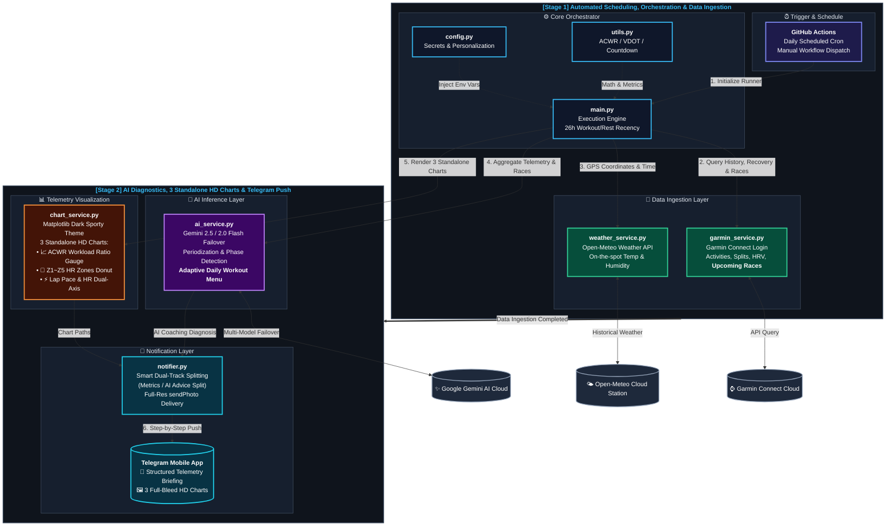

# 🏃 AI Coach - Personalized Smart Marathon AI Coach

<p align="center">
  <a href="README.md">繁體中文</a> | <b>English</b>
</p>

<div align="center">

[](https://www.python.org/)
[](https://github.com/features/actions)
[](https://connect.garmin.com/)
[](https://ai.google.dev/)
[](https://telegram.org/)
[](https://flin1009.github.io/AI_Coach/en.html)
[](README.md)

</div>

> 🌐 **Official Interactive Showcase Website**: [https://flin1009.github.io/AI_Coach/en.html](https://flin1009.github.io/AI_Coach/en.html) (Features mobile Telegram report preview, live VDOT running formula calculator & aerobic decoupling laboratory)

**AI Coach** is a fully automated training diagnosis and prescription system designed for endurance runners. Scheduled daily via **GitHub Actions**, it automatically syncs **Garmin Connect** running and cross-training metrics, tracks **upcoming races within 90 days**, fetches on-the-spot historical temperature & humidity from **Open-Meteo**, and leverages **Google Gemini AI** (equipped with multi-model automatic failover) to conduct "7-activity micro-cycle workload evaluations", "race periodization analysis", and "comprehensive deep-dive workout diagnostics". It synthesizes an adaptive daily workout menu with exact target paces and distances, pushing structured telemetry reports directly to the runner's **Telegram**.

---

## 📐 System Architecture

<div align="center">
  
</div>

<br/>

<details open>
<summary><b>📊 Click to Toggle / Expand Interactive Vector Diagram (Mermaid High-Contrast)</b></summary>


</details>

---

## 🌟 Core Highlights

### 1. ⌚ Comprehensive Garmin Telemetry Analysis
* **Core Performance**: Moving vs. elapsed time, distance, calories, avg/best pace, avg/max heart rate.
* **Advanced Running Dynamics**: Full breakdown of **Running Power (W)**, **Cadence (spm)**, **Stride Length (m)**, **Vertical Oscillation (cm)**, **Stride Ratio (%)**, and **Ground Contact Time (ms)** to evaluate running economy and landing stress.
* **Heart Rate Zones (Z1~Z5)**: Automatic time-in-zone and percentage calculations to examine metabolic stimulus.
* **Physiological Load**: Aerobic & Anaerobic Training Effect (TE), Activity Training Load, and VO2 Max.
* **Detailed Lap Breakdown**: Kilometers-by-kilometer telemetry logging pace, heart rate, cadence, and elevation gain.

### 2. 🌤️ Historical Micro-Weather Ingestion (Open-Meteo)
* Automatically queries Open-Meteo hourly historical archives using the activity's **exact starting coordinates** and **start time**.
* Pulls ambient temperature, relative humidity, heat index (feels-like temperature), and general weather conditions to help the AI evaluate thermal stress, hydration efficiency, and cardiac drift.
* For indoor runs (without GPS track), smoothly falls back to the runner's default station coordinates.

### 3. 🤖 Adaptive Workout Detection & Gemini 503 Failover
* **Adaptive Workout Classification**: AI objectively identifies the true nature of the workout from pace, heart rate, power, and time-in-zone distributions:
  * 🟢 Active Recovery Run
  * 🔵 Zone 2 Aerobic Base Endurance
  * 🟡 Marathon Pace (MP) Run
  * 🟠 Lactate Threshold / Tempo Run
  * 🔴 High-Intensity Intervals / Repetitions
* **7-Activity Micro-Cycle Fatigue Monitoring**: Examines cumulative weekly mileage and cross-training context (cycling, strength training, swimming) to evaluate Acute Training Load and prescribe the next session.
* **Multi-Model Dynamic Fallover**: Scans available Google Gemini Flash models (e.g. Gemini 2.5 Flash, 2.0 Flash) ordered by generation. Automatically fails over to backup models within milliseconds upon 503 UNAVAILABLE peak load errors.

### 4. 📈 ACWR Workload Ratio & Injury Prevention (Acute:Chronic Workload Ratio)
* Automatically backtracks 28 days of training history to compute the ratio between Acute Load (last 7 days) and Chronic Fitness (rolling 28-day weekly average).
* Scientifically flags training adaptation and injury risk zones:
  * 🟢 **Sweet Spot (0.8 ~ 1.3)**: Optimal fitness adaptation with lowest injury risk.
  * 🟡 **Caution Zone (1.3 ~ 1.5)**: Acute fatigue rapidly accumulating; monitors muscle soreness.
  * 🔴 **Danger Zone (≥ 1.5)**: Overtraining alert; AI coach intervenes with mandatory taper/deload.

### 5. 🎯 Jack Daniels' VDOT Formula & 5 Target Paces
* Derives the runner's precise **VDOT Running Fitness Score** from their Marathon Personal Best (PB) using the **Daniels & Gilbert (1979) oxygen cost formula**.
* Computes exact target pace ranges down to `min:sec/km`:
  * 🟢 **E Pace (Easy / LSD)**: Zone 2 aerobic foundation, recovery, and long runs (~65-74% VDOT).
  * 🔵 **M Pace (Marathon)**: Race cruise rhythm and specific marathon pace simulation (~80% VDOT).
  * 🟡 **T Pace (Threshold / Tempo)**: Lactate clearance and speed-endurance threshold (~88% VDOT).
  * 🟠 **I Pace (Interval)**: Stimulates maximal aerobic capacity / VO2 Max (~98% VDOT).
  * 🔴 **R Pace (Repetition)**: Neuromuscular coordination and running economy (~108% VDOT).
* **Precise AI Workout Prescription**: Daily recommendations provide exact targets, e.g., *"Perform 6~8km E-Pace run (5:32~6:08/km)"*.

### 6. 💓 Aerobic Decoupling Rate (Decoupling %)
* Incorporates Joe Friel's renowned **Efficiency Factor (EF = Speed or Power / Heart Rate)** methodology.
* Splits running activities into first half (first 50% distance) and second half (last 50% distance) to compute cardiac drift:

$$
\text{Decoupling (\\%)} = \frac{\text{EF}_1 - \text{EF}_2}{\text{EF}_1} \times 100\\%
$$

* **Four Endurance Tiers**:
  * 🟢 **< 3.0% (Elite Aerobic Base)**: Rock-solid aerobic foundation with virtually zero cardiac drift.
  * 🔵 **3.0% ~ 5.0% (Well-Trained)**: Excellent heart-rate-to-pace equilibrium for marathon endurance.
  * 🟡 **5.1% ~ 8.0% (Moderate Drift)**: Second-half drift detected; flags heat dissipation or mild dehydration.
  * 🔴 **> 8.0% (High Drift)**: Cardiovascular overload or thermal stress; AI coach advises pace reduction.
* **Telemetry Visualization**: Automatically plots purple halfway split lines and decoupling badges on dual-axis trend charts.

### 7. 🏆 Upcoming Race Countdown & Daily Adaptive Workout Menu
* **Garmin Calendar Race Ingestion**: Automatically retrieves confirmed goal races within the next 90 days from Garmin Connect.
* **Smart Calendar De-duplication**: Filters overlapping monthly calendar API grids by unique `item.id`, eliminating duplicates.
* **Race Countdown Cards**: Displays badges like `🚩 2026-10-25 (32 Days to go (~4 Weeks)) EVA Air Marathon | Half Marathon (21.1 km)`.
* **Periodization & Adaptive Menu**: Identifies current training phase (Base, Specific Prep, Peak, Taper) and formulates a specific daily menu.
* **Weekday vs. Weekend Adaptive Logic**:
  * **Weekdays**: Provides a single core workout alongside dual execution options: **Morning Runners** (warmup/fasted fueling) vs. **Evening Runners** (afternoon nutrition/workday stress regulation).
  * **Weekends**: Prescribes a core long workout with dynamic 3-slot adaptations: **Afternoon (Top Pick)**, **Morning (Race Simulation)**, and **Evening (Short & Controlled)**.

### 8. 🩺 HRV & Recovery Graceful Degradation
* Ingests overnight **HRV (last night avg, 7-day baseline, balance status)**, **Resting Heart Rate (RHR)**, and **Body Battery**.
* **Zero-Crash Protection**: If watch is not worn during sleep, the system seamlessly bypasses this section without error; when present, it guides autonomic recovery assessments.

### 9. 📊 Standalone HD Telemetry Charts & Telegram Delivery
* **Smart Message Splitting**:
  * **Message 1 (Telemetry Data)**: Runner background, VDOT paces, race countdown, HRV/RHR recovery, ACWR, recent history, and lap splits.
  * **Message 2 (Gemini AI Coach Insights)**: Begins with `🤖 [Gemini AI Coach Insights]`, presenting comprehensive diagnostics, periodization notes, and the daily menu.
  * **Character Limit Safety**: Automatic segmentation if a section exceeds Telegram's 4,000-character limit.
* **3 Standalone Full-Resolution Charts**: Pushes high-definition charts (**ACWR Gauge**, **HR Zones Donut**, and **Pace & HR Dual-Axis Trend**) individually via Telegram `sendPhoto` for crystal-clear readability on mobile devices.
* **Clean Monospace Lap Tables**: Cleanly formatted lap splits with elevation gain and cadence.
* **LaTeX Cleanup**: Filters raw LaTeX mathematical syntax (`$\rightarrow$`) into standard arrows (`→`).

---

## 📂 Project Structure

```text
AI_Coach/
├── .github/
│   └── workflows/
│       ├── daily_task.yml       # GitHub Actions daily schedule & CI/CD environment
│       ├── test_calendar.yml    # Manual workflow for testing race calendar integration
│       └── cleanup_runs.yml     # One-click workflow to delete all Actions run history
├── docs/                        # GitHub Pages bilingual official showcase website
│   ├── assets/                  # High-resolution architecture diagram & telemetry charts
│   ├── index.html               # Traditional Chinese website (Tailwind CSS + live calculators)
│   └── en.html                  # English website (Tailwind CSS + live running lab)
├── config.py                    # Manages Secrets environment variables & runner settings
├── utils.py                     # VDOT math, decoupling %, race countdown, ACWR & formatting
├── weather_service.py           # Open-Meteo API historical weather ingestion module
├── chart_service.py             # Professional Matplotlib dark-themed telemetry visualization
├── notifier.py                  # Telegram Bot multi-part message & photo delivery
├── garmin_service.py            # Garmin Connect authentication, telemetry, HRV & races
├── ai_service.py                # Gemini AI dynamic scanner, failover & periodized coaching
├── main.py                      # Main orchestration engine (GitHub Actions entry point)
├── test_garmin_calendar.py      # Diagnostic script for local/cloud calendar verification
├── .gitignore                   # Git exclusion rules
├── README.md                    # Traditional Chinese documentation
└── README_EN.md                 # English documentation (this file)
```

---

## 🔑 Prerequisites & Required APIs

The system connects to 4 services. All of them can be used **100% free**:

| Service | Purpose | Registration Required? | Cost | How to Obtain |
| :--- | :--- | :---: | :---: | :--- |
| **Google Gemini API** | AI telemetry analysis, periodization & workout menus | **Yes** | Generous free tier | Apply via [Google AI Studio](https://aistudio.google.com/) |
| **Telegram Bot API** | Automated report & chart delivery to mobile app | **Yes** | Free | Create bot via Telegram [@BotFather](https://t.me/botfather) |
| **Garmin Connect** | Syncs activities, laps, dynamics & recovery data | **No special API** | Free | Uses standard Garmin account credentials |
| **Open-Meteo API** | Fetches historical temperature & humidity by GPS/time | **No key needed** | Free (10,000 req/day) | Direct open access via [Open-Meteo](https://open-meteo.com/) |

---

### 1. 🤖 Google Gemini API Key Guide
Gemini API powers the core reasoning engine for deep endurance analytics.

1. **Visit Google AI Studio**: Go to [Google AI Studio (https://aistudio.google.com/)](https://aistudio.google.com/).
2. **Log in**: Sign in with your personal Google account.
3. **Generate Key**:
   - Click **"Get API key"** in the top left menu.
   - Click **"Create API key"** (select an existing Google Cloud project or create a new one).
4. **Copy & Save**: Copy the string starting with `AIzaSy...`. This is your `GEMINI_API_KEY`.
5. **Documentation**:
   - [Gemini API Python Quickstart](https://ai.google.dev/gemini-api/docs/quickstart?lang=python)
   - [Google AI Studio Documentation](https://ai.google.dev/aistudio)

---

### 2. 💬 Telegram Bot Token & Chat ID Guide
Used to push scheduled reports and telemetry charts directly to your phone.

#### Step A: Create a Telegram Bot for `TG_TOKEN`
1. Open Telegram on your phone or desktop, search for the official bot manager: [`@BotFather`](https://t.me/botfather) (verified with a blue checkmark).
2. Tap **Start** or send `/start`.
3. Send `/newbot` to start the bot creation wizard.
4. Provide two names:
   - **Name**: Display name (e.g. `My AI Coach`).
   - **Username**: Unique username ending in `bot` (e.g. `my_runner_coach_bot`).
5. BotFather will reply with an **HTTP API Token** (format: `7123456789:ABCdefGhIJKlmNoPQRsTUVwxyZ`). This is your `TG_TOKEN`.

#### Step B: Retrieve your Personal `TG_CHAT_ID`
1. **Critical Prerequisite**: Search for your newly created bot username (e.g. `@my_runner_coach_bot`) in Telegram, open the chat, and click **"Start"**. (You must initiate conversation with the bot first so it has permission to message you).
2. Search for an ID lookup bot: [`@userinfobot`](https://t.me/userinfobot) or [`@RawDataBot`](https://t.me/RawDataBot).
3. Click **Start**; the bot will immediately reply with your account info. The **`Id`** field (numeric, e.g. `123456789`) is your `TG_CHAT_ID`.
   > If delivering to a **Telegram group or channel**: Add your bot to the group as an admin. Group Chat IDs typically start with a minus sign (e.g. `-100123456789`).

---

### 3. ⌚ Garmin Connect Account (`GARMIN_EMAIL`, `GARMIN_PWD`)
* Connects using the open-source library [`python-garminconnect`](https://github.com/cyberjunky/python-garminconnect).
* **No Enterprise API Needed**: Simply provide the email and password you use to log into the mobile **Garmin Connect App**.
* **Two-Factor Authentication (2FA) Note**: If 2FA is active on your Garmin account, automated remote logins may be blocked. Ensure standard login access is permitted.

---

### 4. 🌤️ Open-Meteo Weather API
* **100% Free & Zero Key Required!**
* Integrates national weather models (ECMWF, NOAA, JMA, DWD).
* Automatically called via coordinates and timestamp, offering up to **10,000 requests per day** for free.

---

## 🚀 Quick Start & Setup

### Step 1: Fork or Clone the Repository
```bash
git clone https://github.com/your-username/AI_Coach.git
cd AI_Coach
```

### Step 2: Configure Repository Secrets

#### What are GitHub Repository Secrets?
Encrypted environment variables stored securely in your GitHub repository:
* **One-Way Encryption**: Once saved, values cannot be viewed in plain text by anyone.
* **Automatic Masking**: GitHub Actions automatically masks these values as `***` in execution logs.
* **Public Repo Safe**: Even if your repository is Public, external visitors and forks **cannot** read your Secrets.

#### 🛠️ Steps to Add Secrets:
1. Navigate to your repository page on GitHub.
2. Click **Settings** in the top navigation bar.
3. Select **Secrets and variables &rarr; Actions** in the left sidebar.
4. Click the green **"New repository secret"** button.
5. Add each secret name and value from the tables below.

---

#### Secrets Reference Table

##### A. Essential Authentication Secrets (5 Required)
| Secret Name | Description | Example / Instructions |
| :--- | :--- | :--- |
| `GARMIN_EMAIL` | Garmin Connect login email | `your_account@email.com` |
| `GARMIN_PWD` | Garmin Connect login password | Your Garmin account password |
| `TG_TOKEN` | Telegram Bot API Token | Token obtained from [@BotFather](https://t.me/botfather) |
| `TG_CHAT_ID` | Telegram recipient Chat ID | Numeric ID obtained from [@userinfobot](https://t.me/userinfobot) |
| `GEMINI_API_KEY` | Google Gemini API Key | Generated via [Google AI Studio](https://aistudio.google.com/) |

##### B. Optional Personalization Parameters (Safe for Public Repos)
> [!TIP]
> **Privacy by Design**: By injecting your name, birth year, PB, and coordinates via Secrets, your personal details **never appear in public source code**. If left unset, safe defaults are automatically applied.

| Secret Name | Description | Default | Example |
| :--- | :--- | :---: | :--- |
| `RUNNER_NAME` | Runner's name / nickname | `Runner` | Used in report headers and AI coaching prompts |
| `RUNNER_BIRTH_YEAR` | 4-digit birth year | `1985` | Used by AI for age and heart-rate zone estimates |
| `RUNNER_PB` | Marathon Personal Best (PB) | `3:45` | Used for VDOT derivations (e.g. `3:30` or `4:15`) |
| `ZONE2_MAX_HR` | Zone 2 Aerobic Heart Rate Ceiling (bpm) | `140` | Upper limit for aerobic runs (e.g. `136` or `142`) |
| `DEFAULT_LAT` | Fallback Latitude for Weather | `25.03` | Fallback for indoor/treadmill runs |
| `DEFAULT_LON` | Fallback Longitude for Weather | `121.56` | Fallback for indoor/treadmill runs |

---

### Step 3: Verify Configuration in `config.py` (Optional)
If not using GitHub Secrets for runner parameters, you can inspect or adjust defaults in [`config.py`](config.py):
```python
# --- Runner Background Parameters ---
RUNNER_NAME = os.getenv("RUNNER_NAME", "Runner")
RUNNER_BIRTH_YEAR = int(os.getenv("RUNNER_BIRTH_YEAR", "1985"))
RUNNER_PB = os.getenv("RUNNER_PB", "3:45")
ZONE2_MAX_HR = int(os.getenv("ZONE2_MAX_HR", "140"))

# --- System & Weather Parameters ---
ACTIVITIES_COUNT = int(os.getenv("ACTIVITIES_COUNT", "7"))
DEFAULT_LAT = float(os.getenv("DEFAULT_LAT", "25.03"))
DEFAULT_LON = float(os.getenv("DEFAULT_LON", "121.56"))
```

---

### Step 4: GitHub Actions Manual Test & Scheduling

#### 🛠️ Manual Test Execution:
1. Click the **"Actions"** tab in your repository.
   *(If prompted with "I understand my workflows, go ahead and enable them", click to approve)*.
2. In the left workflow list, select **"Garmin AI Coach Report"**.
3. Click the **"Run workflow"** dropdown on the right side.
4. Keep `Branch: main` selected and click the green **"Run workflow"** button.
5. Refresh the page to see the active job. Click in to inspect live logs.
6. Once completed (typically 15-30 seconds), you will receive the full telemetry report and 3 HD charts on Telegram!

#### ⏰ Customizing Daily Delivery Schedule (Cron Adjustment):
Defined in [`.github/workflows/daily_task.yml`](.github/workflows/daily_task.yml):
```yaml
on:
  schedule:
    # Default: Daily at UTC 19:55 (Corresponds to ~03:55-04:00 AM local time in UTC+8)
    - cron: '55 19 * * *'
```
* **UTC Time Conversion Note**: GitHub Actions operates on Coordinated Universal Time (UTC).
  * To receive at **04:00 AM in UTC+8**: Set to `- cron: '55 19 * * *'`.
  * To receive at **06:00 AM in UTC+8**: `06:00 - 8 hours = UTC 22:00`, set to `- cron: '0 22 * * *'`.
  * To receive at **07:00 AM in EST (UTC-5)**: `07:00 + 5 hours = UTC 12:00`, set to `- cron: '0 12 * * *'`.
* 📖 **Helpful Resources**:
  - [Crontab.guru - Visual Cron Schedule Expression Editor](https://crontab.guru/)
  - [GitHub Actions Quickstart Guide](https://docs.github.com/en/actions/writing-workflows/quickstart)

---

### 🌐 Enable GitHub Pages Project Website

This repository includes a standalone, mobile-responsive showcase website in the `docs/` folder (**supporting instant switching between Traditional Chinese and English**, with live VDOT and Aerobic Decoupling calculators):

1. Go to your GitHub repository and click **"Settings"**.
2. Select **"Pages"** in the left sidebar.
3. Under **Build and deployment**:
   - Set **Source** to `Deploy from a branch`.
   - Set **Branch** to `main`, and folder to **`/docs`**.
4. Click **"Save"**.
5. Within 30-60 seconds, your site will be live at `https://<your-username>.github.io/AI_Coach/en.html`!

---

## ⚠️ Disclaimer

* This project is an unofficial open-source tool developed for endurance sports enthusiasts. AI-generated analyses and training prescriptions are for informational and educational purposes only.
* If you experience chest pain, joint strain, or severe fatigue during training, stop immediately and consult a medical physician or certified running coach.

---

## 📄 License

This project is licensed under the [MIT License](LICENSE).
